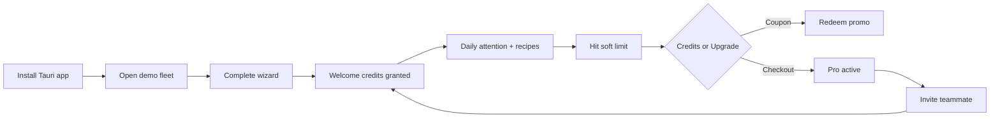

# Growth, engagement & monetization API

**Audience:** product + `ade-api` + desktop ADE  
**Goal:** use the **separate API** for coupons, credits, campaigns, and engagement — while the **Tauri app** only displays signed entitlements and soft-gates.

> Desktop never redeems secrets or invents balances.  
> `ade-api` is source of truth; Stripe remains PCI/payment rail.

---

## 1. Text review — what’s strong vs thin today

### Strong (keep)

| Area | Why it works |
|------|----------------|
| Trust split (`ade-api` vs Tauri) | Coupons/credits belong on the server |
| Soft-gates + local worktrees | Users stay productive when marketing trials expire |
| Plans Hobby / Pro / Team | Clear ladder for upgrade messaging |
| Usage meters | Natural place for “credits remaining” + upgrade CTAs |
| HMAC webhooks | Safe place to apply promo state after payment |

### Thin (improve)

| Gap | Risk |
|-----|------|
| No **coupon / promo code** surface | Hard to run launches, partners, influencers |
| No **credits wallet** (pane-hours, AI tokens, MCP calls) | Only hard plan caps — less flexible engagement |
| No **trial / win-back** state in entitlements | Desktop can’t show “7 days left” honestly |
| No **referral / invite** | Missed viral loop for multi-agent teams |
| Billing UI is mock-only | No redeem UX, no campaign banners |
| No **lifecycle events** to API | Can’t trigger email/push from real operator behavior |
| Marketing copy in README is eng-only | Need operator-facing value props + upgrade moments |

---

## 2. Product model: three balances

Think in **layers**, not only “plan name”:

```text
Plan (Hobby|Pro|Team)     → feature flags + base limits
Credits wallet            → consumable units (tokens, handoffs, premium models)
Promo / coupon overlays   → temporary limit boosts, % off, free months
Engagement state          → onboarding, streaks, attention SLA, referrals
```

**Entitlements blob (extend):**

```json
{
  "userId": "user_…",
  "planId": "pro",
  "status": "trialing",
  "features": ["feature.mcp.export", "feature.handoff.v2"],
  "limits": { "concurrentPanes": 24, "workspaces": 50 },
  "credits": {
    "tokenBalance": 500000,
    "handoffBalance": 40,
    "currency": "ade_credit"
  },
  "promo": {
    "code": "LAUNCH50",
    "label": "50% off first 3 months",
    "endsAt": "2026-09-01T00:00:00Z"
  },
  "trialEndsAt": "2026-08-10T00:00:00Z",
  "exp": 1720000000
}
```

Desktop: display only; burn credits via `POST /v1/credits/consume` (or batch) when real host telemetry exists.

---

## 3. API additions (`ade-api`) — recommended surface

### 3.1 Coupons & promotions

| Method | Path | Purpose |
|--------|------|---------|
| `POST` | `/v1/coupons/redeem` | `{ code }` → apply to customer; return new entitlements |
| `GET` | `/v1/coupons/preview?code=` | Validate before checkout (amount off, trial days) |
| `POST` | `/v1/checkout` | **Extend** body: `{ planId, couponCode? }` → Stripe `discounts` / promotion codes |

**Stripe mapping**

- Partner codes → Stripe **Promotion Codes** / Coupons  
- Internal grants → DB row + entitlement overlay (no Stripe if pure credits)  
- Webhook `customer.discount.*` / subscription updated → recompute entitlements  

**Rules**

- Idempotent redeem (`user_id + code` unique)  
- Abuse: rate limit, one-time vs multi-use, email domain allowlists  
- Never trust desktop “I entered LAUNCH50” without server confirm  

### 3.2 Credits wallet

| Method | Path | Purpose |
|--------|------|---------|
| `GET` | `/v1/credits` | Balances + ledger summary |
| `POST` | `/v1/credits/grant` | Admin/campaign only (API key) |
| `POST` | `/v1/credits/consume` | `{ meter, amount, idempotencyKey, paneId? }` |
| `GET` | `/v1/credits/ledger?cursor=` | Transparency for power users |

**Credit types (examples)**

| Credit | Spent when | Engagement lever |
|--------|------------|------------------|
| `tokens` | Aggregate agent token estimate | Soft cap before upgrade |
| `handoffs` | Session handoff export | Power-user habit |
| `premium_model` | Routed to costly models | Optional upsell |
| `mcp_cloud` | Future hosted MCP | Team feature |

**Hobby:** small monthly top-up (engagement without full Pro).  
**Pro:** larger included pool; overage → buy credit pack (Checkout one-time).  
**Team:** pooled org wallet.

### 3.3 Marketing & lifecycle

| Method | Path | Purpose |
|--------|------|---------|
| `GET` | `/v1/campaigns/active` | In-app banners (title, CTA, dismiss id, segment) |
| `POST` | `/v1/campaigns/:id/dismiss` | Don’t re-show |
| `POST` | `/v1/events` | Product analytics / lifecycle (`onboarding_complete`, `first_fleet`, `merge_gate_pass`) |
| `GET` | `/v1/referrals/me` | Code + stats |
| `POST` | `/v1/referrals/claim` | Apply friend’s code (both sides get credits) |

**Campaign payload (desktop Settings / Command strip)**

```json
{
  "id": "camp_august_launch",
  "placement": "billing_banner" | "command_strip" | "soft_gate",
  "title": "Launch week: 14-day Pro trial",
  "body": "Run full fleets before you pay.",
  "cta": { "label": "Start trial", "action": "checkout", "planId": "pro", "couponCode": "TRIAL14" },
  "endsAt": "2026-08-15T00:00:00Z",
  "priority": 10
}
```

### 3.4 Trials, grace, win-back

| State | Desktop UX | API |
|-------|------------|-----|
| `trialing` | Banner “X days left” + Usage | `trialEndsAt` in entitlements |
| `past_due` | Soft-gate cloud extras; keep local | 72h grace (already in checklist) |
| `canceled` | Win-back campaign + coupon | `GET /campaigns/active?segment=churned` |

---

## 4. Desktop ADE — engagement touchpoints

| Surface | Improvement |
|---------|-------------|
| **Settings → Billing** | Redeem coupon field; show promo chip; “Credits” sub-tab |
| **Settings → Usage** | Dual bars: plan limit **and** credit balance; low-balance CTA |
| **Soft-gate modal** | “Use 50 credits” vs “Upgrade to Pro” (choice reduces rage-churn) |
| **Command strip** | Dismissible campaign chip (from `/campaigns/active`) |
| **Post-wizard** | First-run: grant welcome credits via event `wizard_completed` |
| **Merge gate success** | Celebrate + optional share handoff (referral seed) |
| **Attention inbox empty** | Empty-state tip + link to recipe library (activation) |
| **Handoff export** | If near handoff credit limit, inline upgrade |

**Copy principles**

- Honest: never fake live telemetry for state_blind harnesses  
- Non-blocking: marketing never blocks worktree local work  
- One primary CTA per surface  

---

## 5. Engagement loop (product)



**North-star metrics (API-backed)**

| Metric | Why |
|--------|-----|
| D1 / D7 return (app open + entitlements refresh) | Habit |
| Wizard completion rate | Activation |
| Time-to-first-fleet | Onboarding quality |
| Soft-gate → redeem/checkout conversion | Monetization |
| Credit burn rate | Engagement intensity |
| Referral accepts | Virality |
| Churn after past_due | Billing friction |

Emit via `POST /v1/events` (privacy-safe: no prompt contents).

---

## 6. Recommendations prioritized

### P0 — foundation (next engineering)

1. Extend entitlements with `credits`, `trialEndsAt`, `promo`  
2. `POST /v1/coupons/redeem` + checkout `couponCode`  
3. Settings Billing: redeem input + promo display (wire to API)  
4. Usage dual meter (plan + credits)  

### P1 — engagement

5. Welcome credit grant on `wizard_completed` event  
6. `GET /v1/campaigns/active` + dismissible banner  
7. Soft-gate dual CTA (spend credits / upgrade)  
8. Referral code in Team plan  

### P2 — marketing sophistication

9. Segmented campaigns (trialing, past_due, power user)  
10. Credit packs (one-time Checkout)  
11. Partner coupon dashboard (admin)  
12. Lifecycle email via ade-api → Resend/Postmark (not desktop)  

---

## 7. Security & abuse (must-haves)

| Risk | Control |
|------|---------|
| Coupon farming | One redeem per user/code; device/account binding |
| Credit double-spend | Idempotency keys on consume |
| Client-side balance trust | Signed entitlements + server ledger |
| Event spam | Auth + rate limit + allowlisted event names |
| Promo in desktop binary | Codes validated only on API |

---

## 8. Doc / UX text improvements (this product)

| Location | Improvement |
|----------|-------------|
| README | Short **For operators** blurb (value), not only eng build steps |
| Settings Billing | Replace pure mock language with “Connected to ade-api” states |
| Soft-gates | Frame upgrades as **capacity**, not punishment |
| Hobby plan copy | Emphasize “learn the ADE” + welcome credits |
| Pro copy | Lead with **fleet scale + MCP pack + handoff**, not feature laundry list |
| Team copy | Lead with **shared recipes + org MCP policy + pooled credits** |

### Suggested plan blurb rewrite

| Plan | Operator-facing line |
|------|----------------------|
| Hobby | “Learn multi-agent fleets on your machine. Local worktrees always free.” |
| Pro | “Run full fleets: handoff, MCP packs, merge gate — built for daily operators.” |
| Team | “Share recipes and MCP policy across seats. One bill, pooled capacity.” |

---

## 9. Example API flows

### Redeem coupon then refresh entitlements

```http
POST /v1/coupons/redeem
Authorization: Bearer <jwt>
{ "code": "LAUNCH50" }

GET /v1/entitlements
Authorization: Bearer <jwt>
```

### Checkout with promo

```http
POST /v1/checkout
Authorization: Bearer <jwt>
{ "planId": "pro", "couponCode": "LAUNCH50" }
→ { "url": "https://checkout.stripe.com/..." }
```

### Consume credits (desktop host)

```http
POST /v1/credits/consume
Authorization: Bearer <jwt>
Idempotency-Key: handoff-2026-08-02-abc
{ "meter": "handoff", "amount": 1, "reason": "session_handoff" }
```

---

## 10. Implementation ownership

| Repo | Owns |
|------|------|
| **ade-api** | Coupons, credits ledger, campaigns, events, Stripe promo codes, webhooks |
| **agent-commandcenter** | Redeem UI, banners, soft-gate CTAs, usage display, event emit |
| **Neither** | Storing card data, inventing balances offline |

---

## Related

- [ADE-API.md](./ADE-API.md)  
- [RECOMMENDATIONS-CHECKLIST.md](./RECOMMENDATIONS-CHECKLIST.md)  
- [PRD-HANDOVER.md](./PRD-HANDOVER.md)  
- Companion: https://github.com/jtmilan/ade-api  
